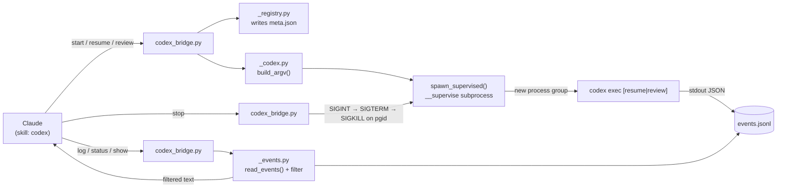

# Architecture

How the plugin's pieces fit together: the components, the request flow through them, the module map, and the design decisions that shaped it. For anyone extending the bridge or debugging a run that isn't behaving as expected.

## 1. Components

| Component | Responsibility |
|---|---|
| `codex_bridge.py` | The CLI entry point. Parses arguments for all nine subcommands, composes and validates them, and prints exactly one line of JSON per call (except `log`, which prints text plus a cursor). |
| `_codex.py` | Composes the actual `codex` argv, spawns the supervised subprocess, manages process groups and signals, and reads Codex's own sqlite thread database for `resume --last` and `--include-external`. |
| `_events.py` | Reads `events.jsonl` incrementally (cursor-based), and formats events per filter level (`compact`/`normal`/`full`/`raw`). |
| `_registry.py` | Reads and writes the run registry (`.codex-runs/<run_id>/meta.json`) — the durable record of what a run was started with. |
| `_util.py` | Bottom-of-the-dependency-graph helpers: JSON output, error formatting, NFC path normalization, `CODEX_HOME` resolution. Imports nothing from its siblings. |

## 2. Request Flow



**Starting a run.** `codex_bridge.py start` composes an argv via `_codex.py`'s `build_argv()`, writes the intended settings to a fresh `meta.json` via `_registry.py`, then spawns a detached supervisor process (`start_new_session=True`, so the supervisor and the `codex` process it launches share one process group). The supervisor waits briefly for a `thread.started` event to backfill `thread_id`, then returns control immediately — the caller doesn't block.

**Resuming a run.** `resume` reads the existing thread's most recent `meta.json` (or resolves `--last` against the registry, falling back to Codex's own thread database if the registry has nothing), rebuilds the argv from scratch — re-asserting the recorded sandbox, model, and reasoning effort as `-c` values — and spawns a new run against the same `thread_id`. Nothing is inherited implicitly; everything that matters is re-stated on every call. This is the mechanism behind [Sandbox Stability](Sandbox-Stability.md).

**Reading progress.** `log`, `status`, and `show` never touch the `codex` process directly — they read `events.jsonl` from the point a cursor left off (`_events.py`'s `read_events()`, which only ever consumes complete lines) and format it according to the requested filter level.

**Stopping a run.** `stop` looks up the run's recorded process-group id (`pgid`) in the registry and signals that group directly — SIGINT, then SIGTERM after a grace period, then SIGKILL as a last resort — never by matching a process name. This is what keeps concurrent runs from interfering with each other. Selection is explicit — `--run` (repeatable), `--group <name>`, or `--all` for every non-terminal run in the project's registry — and nothing stops a run automatically: cost and cleanup policy belong to the user, not the skill.

## 3. Module Map

```
.claude/skills/codex/
├── SKILL.md                    # what Claude reads to learn the CLI surface and gotchas
├── references/
│   ├── environment.md          # CODEX_HOME, isolation, sandbox mechanics, auth
│   ├── event-stream.md         # event schemas, filter levels, cursors, `show`
│   └── troubleshooting.md      # symptom → cause → fix, and the out-of-scope list
└── scripts/
    ├── codex_bridge.py         # CLI entry point, all 9 subcommands
    ├── _codex.py                # argv composition, process/thread-db management
    ├── _events.py                # event filtering, cursor logic
    ├── _registry.py              # run registry read/write
    └── _util.py                  # low-level helpers

tests/                          # see Testing.md — T1 unit + T2 integration suites
docs/
├── plan/                       # design rationale and decision log
├── measurements/               # T3 filter-calibration raw data
└── wiki/                       # this documentation

<project>/.codex-runs/          # the run registry itself — created per project, gitignored
```

## 4. Design Decisions

A few choices worth knowing the reasoning behind, since they aren't obvious from the code alone (full rationale in `.claude/harness-spec.md` and `docs/plan/codex-skill-implementation-plan.md`):

- **The run registry exists at all** because `codex exec resume` has no way to be told a sandbox — the only way to hold one stable across turns is to remember it and re-assert it on every call.
- **Isolation (`--ignore-user-config`) is the default**, not an opt-in, because inheriting a user's full Codex configuration measurably triggers a much larger, noisier prompt (see [Sandbox Stability § isolation cost](Sandbox-Stability.md#3-the-cost-of-inheriting-config)) — and because inherited config is also what re-enables the sandbox-drift bug in the first place.
- **Intervention is stop-then-resume, not mid-turn injection**, because `codex exec` has no input channel once a turn is running. SIGINT is what makes stop-then-resume viable: it leaves the thread in a state that can be resumed with its completed work intact, rather than corrupting it.
- **No instruction-injection preset library.** An earlier design wrapped fixed "methodology" text around every prompt; this was dropped, since Claude — the caller — already knows what a given task needs and can write it directly into the prompt rather than picking from a menu of presets.
- **The default filter level is chosen by measurement, not assumption** — see [Context Discipline & Event Log Levels](Context-Discipline.md) for the actual numbers behind `compact` being the default.
- **No bundled agent or fixed workflow wraps this skill.** Watching a run's log and deciding when to intervene is something the calling agent (Claude) needs to do directly — a subagent can't ask a clarifying question, and the shape of "delegate this to Codex" varies too much per task to freeze into one fixed sequence.

---
**Next:** [Sandbox Stability](Sandbox-Stability.md) · [CLI Reference](CLI-Reference.md)
[Back to index](README.md)
